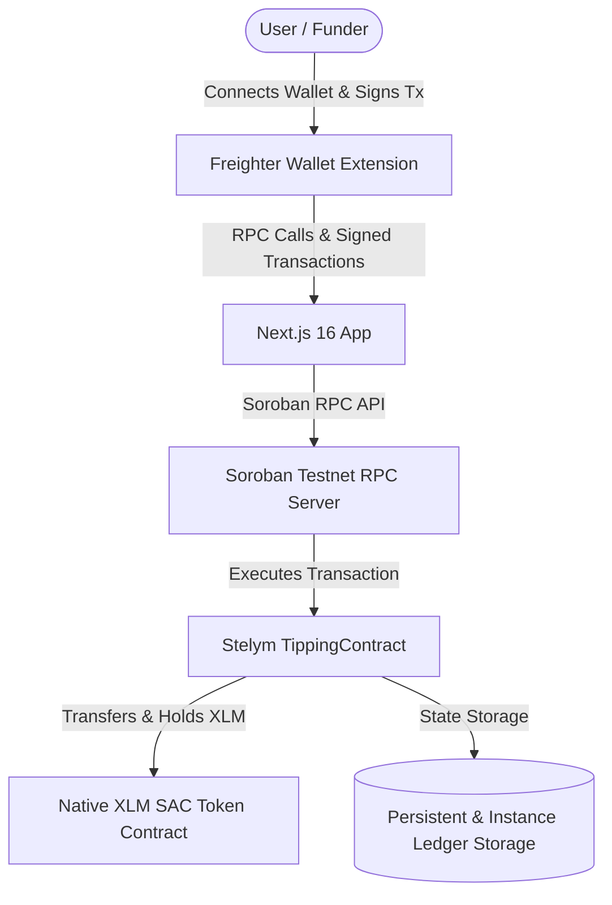
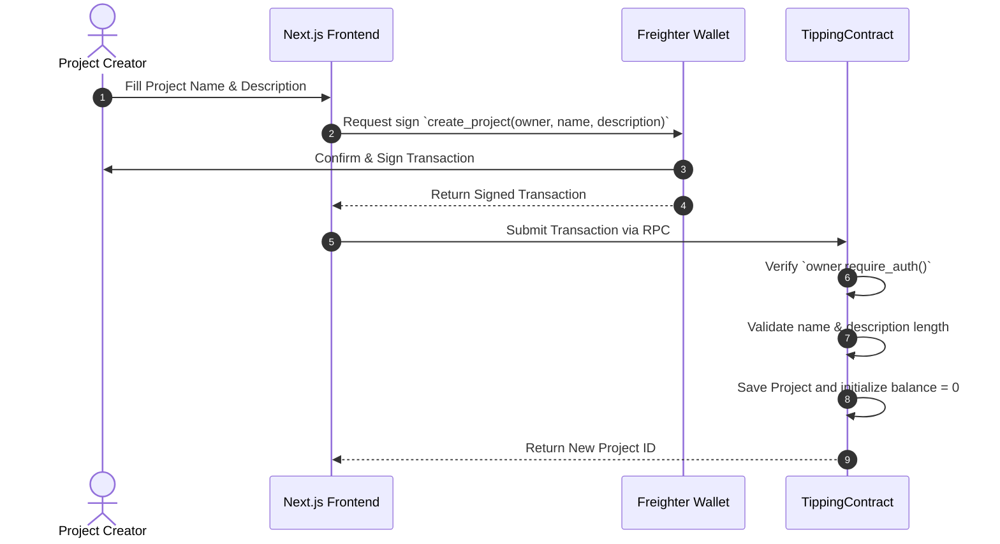
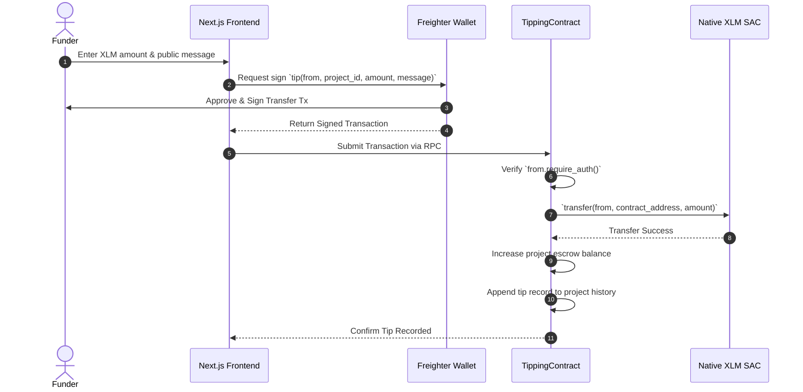
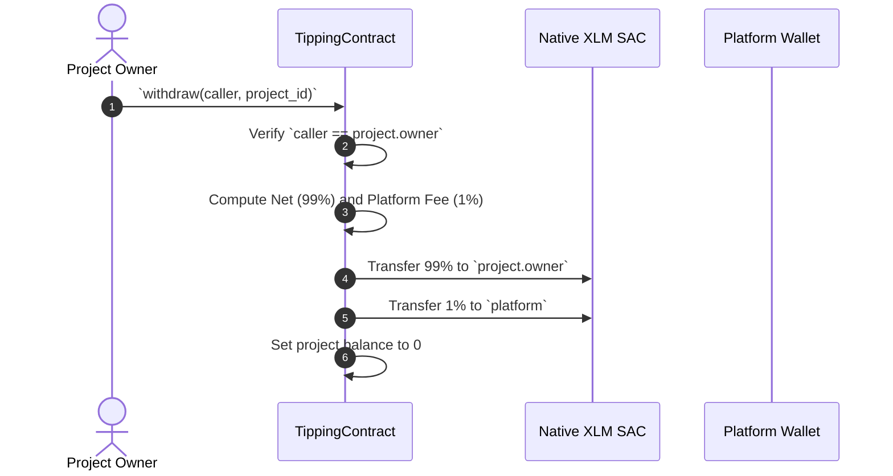

# Stelym Architecture

This document provides an overview of the system architecture, smart contract design, data flow, and frontend integration for **Stelym**.

---

## 1. System Overview

Stelym is a decentralized tipping platform built on the **Stellar Soroban** smart contract network. It allows project creators to register projects and receive native XLM tips held in on-chain escrow until withdrawn.



---

## 2. System Components

### 2.1 Smart Contract Layer (Soroban / Rust)

- **Framework**: Rust `soroban-sdk` v25 targeting `wasm32v1-none`.
- **Contract Type**: `TippingContract`
- **Native SAC Integration**: Interacts directly with Stellar Asset Contract (SAC) for native XLM token transfers and balance accounting.

#### State & Storage Layout

| Key | Storage Type | Data Stored | Description |
| --- | --- | --- | --- |
| `DataKey::XlmToken` | Instance | `Address` | Address of the native XLM SAC contract |
| `DataKey::Platform` | Instance | `Address` | Address of the platform fee recipient |
| `DataKey::NextProjectId` | Persistent | `u64` | Auto-incrementing project ID counter |
| `DataKey::Project(u64)` | Persistent | `Project` struct | Project metadata (id, owner, name, description) |
| `DataKey::Balance(u64)` | Persistent | `i128` | Current escrow balance in stroops (1 XLM = 10,000,000 stroops) |
| `DataKey::NextTipId` | Persistent | `u64` | Auto-incrementing tip ID counter |
| `DataKey::Tip(u64)` | Persistent | `Tip` struct | Tip details (id, project_id, from, amount, message, timestamp) |
| `DataKey::ProjectTipIds(u64)` | Persistent | `Vec<u64>` | List of tip IDs associated with a project |

#### Data Structures

```rust
pub struct Project {
    pub id: u64,
    pub owner: Address,
    pub name: String,
    pub description: String,
}

pub struct Tip {
    pub id: u64,
    pub project_id: u64,
    pub from: Address,
    pub amount: i128,
    pub message: String,
    pub timestamp: u64,
}
```

---

## 3. Data Flows & Execution Lifecycles

### 3.1 Project Creation Flow



---

### 3.2 Tipping Flow (Escrow Deposit)



---

### 3.3 Withdrawal & Platform Fee Settlement

When the project owner initiates a withdrawal:
1. `caller.require_auth()` ensures only the verified project owner can withdraw.
2. The contract calculates the **1% platform fee**:
   $$\text{fee} = \lfloor \frac{\text{balance}}{100} \rfloor$$
   $$\text{net} = \text{balance} - \text{fee}$$
3. If $\text{balance} < 100\text{ stroops}$, fee evaluates to $0$.
4. The contract transfers $\text{net}$ stroops to `project.owner`.
5. If $\text{fee} > 0$, the contract transfers $\text{fee}$ stroops to `platform`.
6. Project balance is reset to $0$, while tip history remains preserved permanently.



---

## 4. Frontend Architecture (Next.js & TypeScript)

```text
src/
├── app/                  # Next.js App Router
│   ├── layout.tsx        # Root layout, theme provider, header & branding
│   ├── page.tsx          # Home page (Project listing & creation)
│   ├── projects/[id]/    # Project details, tipping form, tip history & withdrawal
│   └── globals.css       # Neobrutalist design system & dark/light theme CSS
├── components/           # UI Components
│   ├── Button.tsx        # Neobrutalist button with variants
│   ├── CreateProjectForm # Project creation form with validation
│   ├── FeedbackBanner    # Interactive success/error feedback banner
│   ├── ProjectDetail     # Project view, escrow cards, tip form & history
│   ├── ProjectList       # Dynamic project card grid
│   ├── ThemeToggle       # Dark / Light mode toggle button
│   ├── TippingApp        # Main application layout & state manager
│   ├── WalletButton      # Freighter connection & account indicator
│   └── WalletRequiredBanner # Informational banner for write operations
├── hooks/                # Custom React Hooks
│   ├── useFreighter.ts   # Freighter connection, address, network state
│   ├── useTheme.ts       # Light/Dark mode state and persistence
│   └── useTipping.ts     # Project query & transaction execution hooks
├── lib/                  # Utilities & Contract Clients
│   ├── contract.ts       # Typed wrapper around generated contract client
│   └── stellar.ts        # Network constants, formatting & address helpers
└── providers/            # Context Providers
    ├── AppProviders.tsx  # Master provider wrapper
    ├── FreighterProvider # Global wallet connection provider
    └── ThemeProvider.tsx # Global theme provider (Light / Dark mode)
```

---

## 5. Security & Authentication Model

- **On-Chain Authorization**: Sensitive state transitions (`create_project`, `tip`, `withdraw`) strictly enforce `Address::require_auth()` natively within Soroban.
- **Client-Side Signatures**: Private keys never leave the user's Freighter extension; transactions are assembled, simulated, and passed to Freighter for user confirmation.
- **Input Boundaries**:
  - `name`: Max 64 characters, non-empty.
  - `description`: Max 280 characters.
  - `message`: Max 280 characters.
  - `amount`: Must be strictly positive integer ($> 0\text{ stroops}$).
- **Escrow Integrity**: Tips are locked inside the contract address and cannot be accessed or withdrawn by any party other than the authenticated project owner.

---

## 6. On-Chain Event Streaming System

The smart contract publishes structured Soroban events via `env.events().publish(...)` for all state modifications:

| Event | Topics | Data Payload | Description |
| --- | --- | --- | --- |
| `create` | `("create", owner: Address)` | `project_id: u64` | Emitted when a new project is created |
| `tip` | `("tip", project_id: u64, from: Address)` | `(amount: i128, tip_id: u64)` | Emitted when a public tip is deposited into escrow |
| `withdraw` | `("withdraw", project_id: u64, caller: Address)` | `(net_amount: i128, platform_fee: i128)` | Emitted upon successful owner withdrawal and fee split |

These events can be streamed in real-time by indexing nodes and client interfaces via the Soroban RPC `getEvents` endpoint.

---

## 7. Testing Architecture

- **Smart Contract Tests**: 10 unit tests in Rust (`cargo test`) utilizing Soroban test environment (`soroban_sdk::Env`), simulated auth (`mock_all_auths()`), and SAC token contract deployment.
- **Frontend Unit Tests**: 17 component and unit tests powered by **Vitest** + **React Testing Library** + **jsdom** verifying wallet state transitions, input boundary checks, stellar unit conversions (`xlmToStroops`), and theme toggling.
