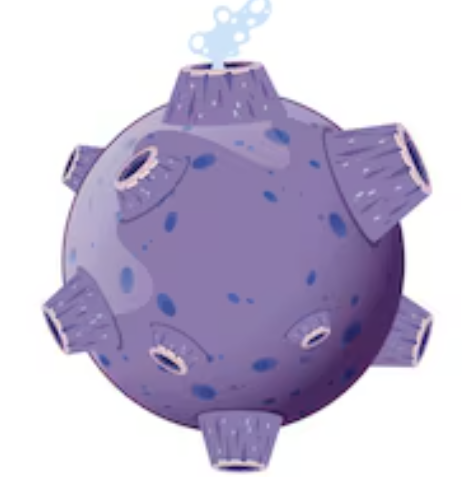
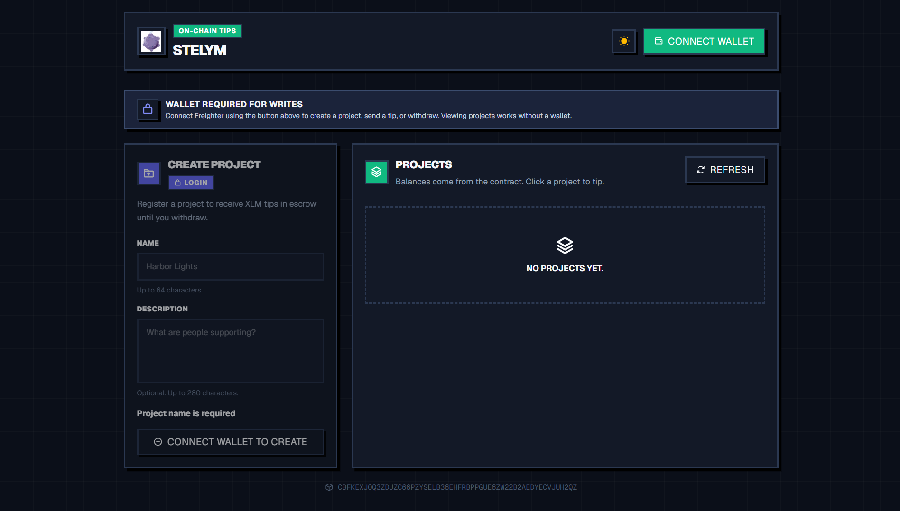
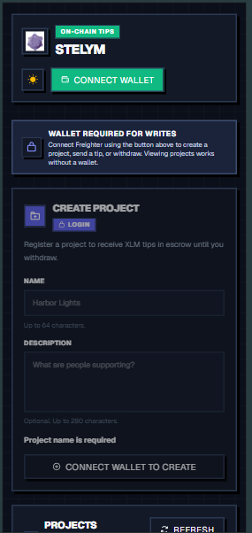
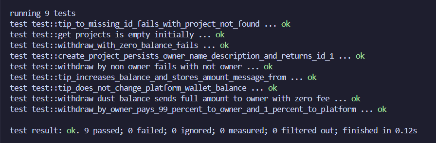

<p align="center">
  
</p>

<h1 align="center">Stelym</h1>

<h3 align="center">Tip project owners with native XLM on Stellar Soroban.</h3>

<p align="center">
  Register a project, send public tips into on-chain escrow, and withdraw with a 1% platform fee.<br />
  Rust smart contract, Next.js frontend, Freighter wallet, and GitHub Actions CI.
</p>

<p align="center">
  <a href="https://stelym.vercel.app"></a>
  <a href="https://github.com/abantikakundu/stelym/actions/workflows/smart-contract.yml"></a>
  <a href="https://stellar.org"></a>
  <a href="https://developers.stellar.org/docs/build/smart-contracts"></a>
  <a href="https://nextjs.org/"></a>
</p>

<p align="center">
  <strong>Live demo:</strong> <a href="https://stelym.vercel.app">https://stelym.vercel.app</a><br />
  <strong>Repository:</strong> <a href="https://github.com/abantikakundu/stelym">abantikakundu/stelym</a><br />
  <strong>Contract:</strong> <code>CBFKEXJOQ3ZDJZC66PZYSELB36EHFRBPPGUE6ZW22B2AEDYECVJUH2QZ</code>
</p>

<p align="center">
  
  
</p>
<p align="center">
  <sub>Web · home &nbsp;&nbsp; Mobile · project detail</sub>
</p>

---

## Navigation

- [Live Demo](#live-demo)
- [What it does](#what-it-does)
- [Architecture](#architecture)
- [Tech Stack](#tech-stack)
- [Smart Contract](#smart-contract)
  - [Data](#data)
  - [Functions](#functions)
  - [Errors](#errors)
- [Frontend](#frontend)
- [Getting Started](#getting-started)
  - [Prerequisites](#prerequisites)
  - [Build and test the contract](#build-and-test-the-contract)
  - [Run the frontend](#run-the-frontend)
- [CI/CD](#cicd)
- [Test Results](#test-results)
- [Deploy / Upgrade Contract](#deploy--upgrade-contract)
- [Checklist](#checklist)
- [License](#license)

---

## Live Demo

| Field | Value |
| --- | --- |
| **App** | [https://stelym.vercel.app](https://stelym.vercel.app) |
| **Network** | Stellar Soroban Testnet |
| **Wallet** | [Freighter](https://www.freighter.app/) (required for create, tip, withdraw) |
| **Contract ID** | `CBFKEXJOQ3ZDJZC66PZYSELB36EHFRBPPGUE6ZW22B2AEDYECVJUH2QZ` |
| **Explorer** | [Stellar Lab](https://lab.stellar.org/r/testnet/contract/CBFKEXJOQ3ZDJZC66PZYSELB36EHFRBPPGUE6ZW22B2AEDYECVJUH2QZ) |
| **RPC** | `https://soroban-testnet.stellar.org` |

Reads work without a wallet. Writes need Freighter on **Testnet**, funded via [Friendbot](https://laboratory.stellar.org/#account-creator?network=test).

---

## What it does

Stelym lets anyone list a project and receive XLM tips on-chain:

- **Create a project** — the connected wallet becomes the owner
- **Tip** — send native XLM plus an optional public message
- **Escrow** — tips stay in the contract until the owner withdraws
- **Withdraw** — 99% goes to the owner, 1% to the platform address set at deploy
- Projects cannot be edited or deleted. Tip history stays after withdraw.

---

## Architecture

See [**ARCHITECTURE.md**](./ARCHITECTURE.md) for full system diagrams, smart contract storage layouts, and sequence flows.

---

## Tech Stack

| Layer | Technology |
| --- | --- |
| Smart contract | Rust, Soroban SDK v25 |
| Frontend | Next.js 16, React 19, Tailwind CSS 4 |
| Wallet | Freighter (`@stellar/freighter-api`) |
| Blockchain SDK | `@stellar/stellar-sdk` |
| Bindings | `stellar contract bindings typescript` |
| CI | GitHub Actions (`.github/workflows/smart-contract.yml`) |
| Hosting | Vercel |

---

## Smart Contract

Constructor: `__constructor(xlm_token, platform)` — both addresses are immutable.

Native XLM SAC (testnet): `CBFKEXJOQ3ZDJZC66PZYSELB36EHFRBPPGUE6ZW22B2AEDYECVJUH2QZ`

### Data

```rust
pub struct Project { id, owner, name, description }
pub struct Tip { id, project_id, from, amount, message, timestamp }
```

Amounts are stroops (`i128`). 1 XLM = 10_000_000 stroops.

### Functions

| Function | Auth | Description |
| --- | --- | --- |
| `create_project(owner, name, description)` | owner | Creates a project, returns sequential id |
| `get_projects` | — | All projects |
| `get_project(id)` | — | One project |
| `get_tips(project_id)` | — | Tip history |
| `get_balance(project_id)` | — | Unwithdrawn escrow |
| `tip(from, project_id, amount, message)` | from | Transfer XLM into escrow; no fee |
| `withdraw(caller, project_id)` | caller must be owner | Pay 99% to owner, 1% to platform; balance → 0 |

Fee is charged **only on withdraw**: `fee = balance / 100`. If `balance < 100` stroops, fee is 0.

### Errors

`EmptyName`, `NameTooLong`, `DescriptionTooLong`, `MessageTooLong`, `InvalidAmount`, `ProjectNotFound`, `NotOwner`, `ZeroBalance`

---

## Frontend

- `/` — create project + list (name, owner, escrowed balance)
- `/projects/[id]` — tip form, history, withdraw (owner only)
- Unknown id shows **Project not found**

---

## Getting Started

### Prerequisites

- Node.js 22+
- Rust 1.92 + `wasm32v1-none`
- Stellar CLI v25+
- Freighter (for writes)

### Build and test the contract

```bash
rustup target add wasm32v1-none
stellar contract build
cargo test
```

WASM output: `target/wasm32v1-none/release/tipping.wasm`

### Run the frontend

```bash
npm install
npm run dev
```

Open [http://localhost:3000](http://localhost:3000). Switch Freighter to **Testnet** and fund via Friendbot.

---

## CI/CD

Workflow: [`.github/workflows/smart-contract.yml`](./.github/workflows/smart-contract.yml)

Runs on every push and pull request to `main`. Latest run: [success](https://github.com/abantikakundu/stelym/actions/runs/31873185997).

| Step | Description |
| --- | --- |
| Install Rust 1.92 + `wasm32v1-none` | Soroban WASM target |
| Install Stellar CLI | Official CLI action |
| `cargo fmt --all -- --check` | Formatting |
| `stellar contract build` | Compile `tipping.wasm` |
| `cargo test --workspace` | 9 contract unit tests |

Frontend deploys automatically on [Vercel](https://stelym.vercel.app).

---

## Test Results

<p align="center">
  
</p>

```text
running 9 tests
test test::tip_to_missing_id_fails_with_project_not_found ... ok
test test::get_projects_is_empty_initially ... ok
test test::withdraw_with_zero_balance_fails ... ok
test test::create_project_persists_owner_name_description_and_returns_id_1 ... ok
test test::withdraw_by_non_owner_fails_with_not_owner ... ok
test test::tip_increases_balance_and_stores_amount_message_from ... ok
test test::tip_does_not_change_platform_wallet_balance ... ok
test test::withdraw_dust_balance_sends_full_amount_to_owner_with_zero_fee ... ok
test test::withdraw_by_owner_pays_99_percent_to_owner_and_1_percent_to_platform ... ok

test result: ok. 9 passed; 0 failed; 0 ignored; 0 measured; 0 filtered out; finished in 0.12s
```

---

## Deploy / Upgrade Contract

```bash
stellar contract build

stellar contract deploy \
  --wasm target/wasm32v1-none/release/tipping.wasm \
  --network testnet \
  --source YOUR_KEY_NAME \
  -- \
  --xlm-token CBFKEXJOQ3ZDJZC66PZYSELB36EHFRBPPGUE6ZW22B2AEDYECVJUH2QZ \
  --platform YOUR_PLATFORM_G_ADDRESS
```

Then update `CONTRACT_ID` in `src/lib/stellar.ts` and regenerate bindings:

```bash
stellar contract bindings typescript \
  --wasm target/wasm32v1-none/release/tipping.wasm \
  --output-dir lib/bindings \
  --overwrite

npm run build:bindings
```

---

## Checklist

- [x] **Public GitHub repository** — [https://github.com/abantikakundu/stelym](https://github.com/abantikakundu/stelym)
- [x] **README with complete documentation** — Architecture, smart contract spec, setup instructions, and test output
- [x] **Minimum 10+ meaningful commits** — Commit history across contract, UI, bindings, and CI
- [x] **Live demo link (Vercel, Netlify, or similar)** — [https://stelym.vercel.app](https://stelym.vercel.app)
- [x] **Contract deployment address** — [`CBFKEXJOQ3ZDJZC66PZYSELB36EHFRBPPGUE6ZW22B2AEDYECVJUH2QZ`](https://lab.stellar.org/r/testnet/contract/CBFKEXJOQ3ZDJZC66PZYSELB36EHFRBPPGUE6ZW22B2AEDYECVJUH2QZ)
- [x] **Transaction hash for contract interaction** — [`19110a22ebe746757972f7a322ab0acf45e9735550c0c3adc5544871b58e0084`](https://stellar.expert/explorer/testnet/tx/19110a22ebe746757972f7a322ab0acf45e9735550c0c3adc5544871b58e0084)
- [x] **Screenshot showing:**
  - [x] **Mobile responsive UI** — [`screenshots/mobile_view.png`](./screenshots/mobile_view.png)
  - [x] **CI/CD pipeline running** — [GitHub Actions CI](https://github.com/abantikakundu/stelym/actions)
  - [x] **Test output with 3+ passing tests** — 9 unit tests passing [`screenshots/cargo_test.png`](./screenshots/cargo_test.png)
- [x] **Demo video link (1–2 minutes)** — [Demo Video](video-link)

---

## License

This project is licensed under the [Apache-2.0 License](./LICENSE) (Stellar ecosystem standard).
